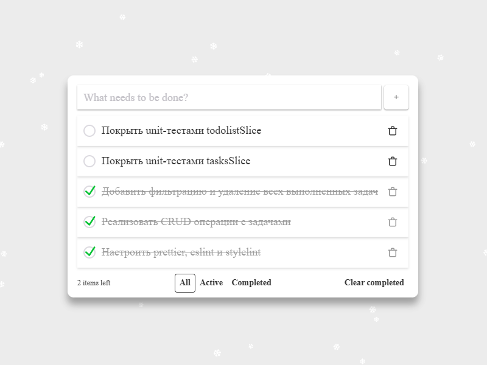

# Todos Application

## Описание

Это Todos-приложение позволяет пользователям создавать, редактировать, удалять и фильтровать задачи. Приложение обеспечивает минималистичный и интуитивно понятный интерфейс, предоставляя базовый функционал для управления повседневными делами.



## Стек технологий

- **React**: библиотека для разработки пользовательского интерфейса.
- **TypeScript**: добавляет статическую типизацию для повышения надежности кода.
- **Sass (SCSS)**: для стилизации компонентов.
- **React Toastify**: отображение уведомлений.
- **@reduxjs/toolkit** и **react-redux**: для управления состоянием приложения.
- **Radix UI**: компоненты для создания чекбоксов и меток.

## Функционал

- **Добавление задач**: создание новых задач.
- **Удаление задач**: удаление одной или нескольких задач.
- **Изменение статуса задачи**: переключение между активным и завершённым статусом задачи.
- **Изменение названия задачи по двойному щелчку**: удобное редактирование названия задачи.
- **Фильтрация**: просмотр всех, активных или завершённых задач.
- **Локальное хранилище**: сохранение задач для обеспечения их доступности после перезагрузки страницы.
- **Интерактивные уведомления**: отображение ошибок и успешных действий.

## Как запустить проект

### 1. Клонирование репозитория

```bash
# Склонируйте репозиторий на локальную машину
git clone https://github.com/MrEvgeniy1989/todos.git
cd todos
```

### 2. Установка зависимостей

Убедитесь, что у вас установлен Node.js (рекомендуемая версия: 18.x или выше). Затем выполните:

```bash
npm install
```

### 3. Запуск проекта в режиме разработки

```bash
npm run start
```

Проект откроется по адресу [http://localhost:3000](http://localhost:3000).

### 4. Линтинг и форматирование

Чтобы проверить код на наличие ошибок или привести его к единообразному стилю, выполните:

```bash
npm run lint
npm run format
```

## Дополнительная информация

- Все данные хранятся в `localStorage`, поэтому приложение не требует серверной части.
- Уведомления об ошибках отображаются с помощью `React Toastify`.
